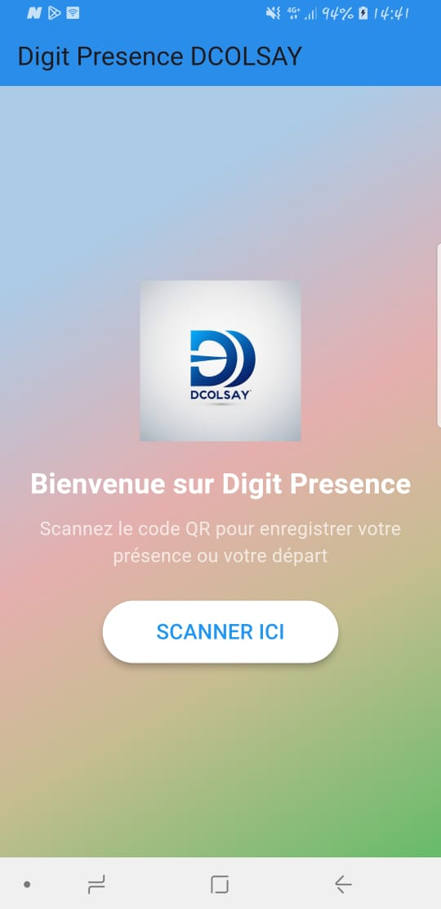
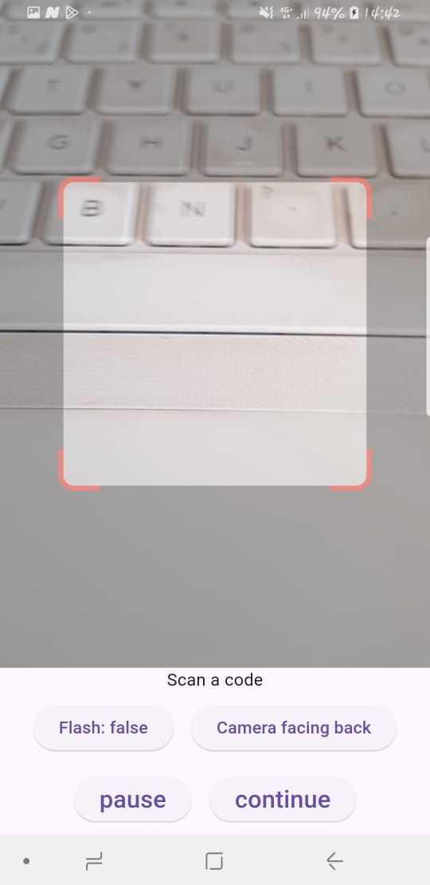

# Digit Presence DCOLSAY

## Description
**Digit Presence DCOLSAY** est une application mobile développée avec Flutter pour enregistrer la présence des employés via un scan de QR code. L'application permet de scanner un QR code, d'afficher un message de succès, et de revenir à la page d'accueil après vérification.

## Fonctionnalités
- **Page d'accueil** : Interface utilisateur attrayante avec un dégradé de couleurs inspiré de Google.
- **Scanner de QR code** : Intégration d'un scanner fonctionnel avec gestion de la caméra (flash, changement de caméra, pause etc.).
- **Affichage des résultats** : Un message de succès et une icône s'affichent après un scan réussi.
- **Retour à l'accueil** : Un bouton permet de revenir à la page d'accueil après vérification des informations.

## Technologies utilisées
- **Flutter** : Framework de développement d'applications mobiles.
- **qr_code_scanner_plus** : Package Flutter pour le scan de QR code.
- **Dart** : Langage de programmation utilisé pour développer l'application.

## Installation
Suivez ces étapes pour installer et exécuter l'application localement :
1. **Cloner le dépôt** :
   - https://github.com/adekomen/digit_presence_dcolsay.git
   - cd digit_presence_dcolsay
2. **flutter pub get** 
3. **flutter run**
